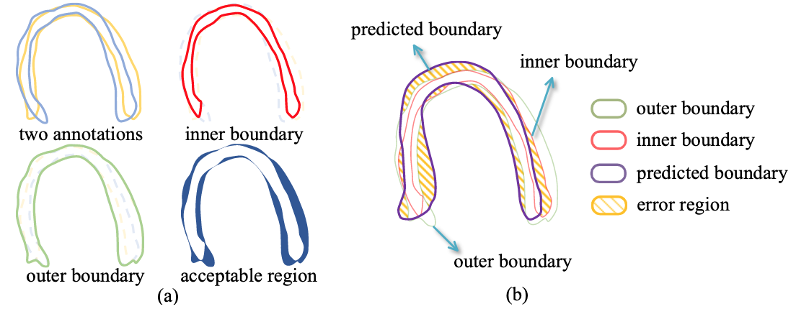

# Extended Dice
Pytorch implementation of extended dice for paper: Segmentation with Multiple Acceptable Annotations: A Case Study of Myocardial Segmentation in Contrast Echocardiography, IPMI 2021. [paper](https://link.springer.com/chapter/10.1007/978-3-030-78191-0_37)

<p align="center">
  
</p>

Train example:
```
from loss import ExtendedDiceLoss
ed_loss = ExtendedDiceLoss()
for idx, (images, labels) in enumerate(data_loader):
    # images: [B,C,X,Y], labels: [B,N,X,Y], N is the number of annotators
    images = images.float().cuda()
    labels = labels.long().cuda()
    y_predict = model(images)
    y_predict = F.softmax(y_predict,dim=1)
    loss = ed_loss(y_predict, labels)
    loss.backward()
```
